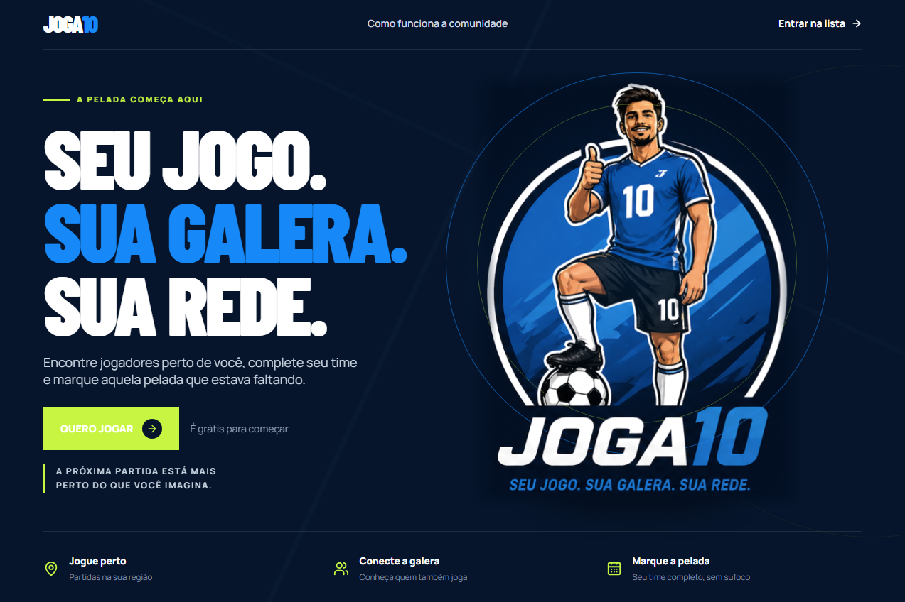

# JOGA10

> Seu jogo. Sua galera. Sua rede.

O JOGA10 é uma plataforma criada para aproximar jogadores de futebol amador, facilitar a organização de partidas e transformar aquela pelada que quase aconteceu em um jogo marcado, com time completo e gente disposta a jogar.

## Prévia da landing page



*Captura de tela da landing page atual do JOGA10.*

## Como surgiu a ideia

Quem joga futebol amador conhece o problema: chega o dia da partida, alguém desiste, faltam jogadores para completar os times e o grupo inteiro precisa correr atrás de substitutos. Muitas vezes, a vontade de jogar existe, mas a falta de pessoas disponíveis, próximas e interessadas acaba cancelando a pelada.

O JOGA10 nasce para resolver esse desencontro. A ideia é criar um ponto de encontro para quem quer jogar, seja para completar uma equipe, conhecer novos jogadores ou encontrar uma partida na própria região. Em vez de depender apenas de mensagens perdidas em grupos, os jogadores poderão se conectar de maneira simples, prática e organizada.

## A proposta

O JOGA10 quer tornar o futebol amador mais acessível e espontâneo. A plataforma foi pensada para que qualquer pessoa consiga:

- Encontrar jogadores perto de onde mora ou costuma jogar.
- Descobrir partidas que precisam de novos participantes.
- Criar uma pelada e convidar outras pessoas.
- Completar o time sem precisar cancelar o jogo por falta de jogadores.
- Conhecer uma comunidade local de pessoas que também gostam de futebol.

Mais do que organizar partidas, o JOGA10 pretende fortalecer a comunidade em torno do esporte e facilitar encontros presenciais por meio de uma experiência digital leve e amigável.

## Como o futuro app vai funcionar

### 1. Cadastro do jogador

O usuário criará seu perfil informando dados básicos, região onde joga e, futuramente, preferências como posição, nível de experiência e disponibilidade. Essas informações ajudarão a plataforma a apresentar partidas e jogadores mais relevantes.

### 2. Busca por partidas e jogadores

Na tela principal, o usuário poderá visualizar partidas próximas, filtrar por local, data e horário e encontrar pessoas interessadas em jogar. A experiência será orientada à ação: encontrar uma partida, demonstrar interesse e entrar em contato com a organização.

### 3. Criação de uma pelada

Qualquer jogador poderá criar uma partida informando local, data, horário, formato do jogo e quantidade de vagas disponíveis. A partida ficará visível para a comunidade, permitindo que outros jogadores encontrem e solicitem participação.

### 4. Convites e conexões

Os organizadores poderão convidar jogadores diretamente. Os participantes também poderão formar conexões com pessoas que já conheceram em outras partidas, criando uma rede confiável para futuros jogos.

### 5. Confirmação do jogo

A plataforma deverá ajudar o organizador a acompanhar os participantes confirmados, as vagas restantes e as informações importantes da partida. Assim, todos chegam ao jogo sabendo onde, quando e com quem vão jogar.

## Experiência que estamos construindo

A primeira tela do JOGA10 apresenta a ideia de forma direta e convidativa. A identidade visual combina azul profundo, azul vibrante e verde-lima para transmitir energia, movimento e o clima de uma partida. A ilustração do jogador funciona como o principal ponto visual da página, enquanto a mensagem resume a proposta:

> Encontre jogadores perto de você, complete seu time e marque aquela pelada que estava faltando.

Os três pilares apresentados no rodapé resumem o funcionamento do produto:

- **Jogue perto:** encontre partidas e jogadores na sua região.
- **Conecte a galera:** conheça pessoas que também gostam de jogar.
- **Marque a pelada:** organize o jogo e complete seu time.

## Estado atual do projeto

Neste primeiro momento, o projeto conta com uma landing page responsiva que apresenta a proposta do JOGA10 e prepara o caminho para a plataforma completa. A página já possui:

- Layout responsivo para desktop, tablet e mobile.
- Navegação por âncora entre as áreas da página.
- Chamada de entrada para interessados em participar.
- Imagem principal integrada à identidade visual.
- Rodapé com os três benefícios centrais do produto.
- Ajustes de posicionamento para evitar sobreposições em diferentes resoluções.

As funcionalidades de cadastro, busca, criação de partidas, convites e gerenciamento de participantes fazem parte das próximas etapas de desenvolvimento.

## Tecnologias utilizadas

- [React](https://react.dev/) para a construção da interface.
- [TypeScript](https://www.typescriptlang.org/) para tipagem e maior segurança no desenvolvimento.
- [Vite](https://vite.dev/) como ferramenta de desenvolvimento e build.
- [Tailwind CSS](https://tailwindcss.com/) para as classes de layout e responsividade.
- [Lucide React](https://lucide.dev/) para os ícones da interface.
- CSS personalizado para identidade visual, tipografia e tratamento da imagem principal.

## Como executar o projeto

### Pré-requisitos

- Node.js instalado.
- npm disponível no terminal.

### Instalar dependências

```bash
npm install
```

### Iniciar o ambiente de desenvolvimento

```bash
npm run dev
```

Depois, acesse a URL exibida pelo Vite no terminal, normalmente `http://localhost:5173`.

### Gerar a versão de produção

```bash
npm run build
```

### Verificar o código

```bash
npm run lint
```

## Estrutura principal

```text
src/
  App.tsx       Componente principal e estrutura da landing page
  App.css       Estilos da identidade visual e responsividade
  index.css     Reset e estilos globais
  main.tsx      Ponto de entrada da aplicação React
  assets/       Imagens utilizadas na interface
```

## Próximos passos

O desenvolvimento do JOGA10 poderá evoluir pelas seguintes frentes:

1. Criar fluxo real de cadastro e autenticação.
2. Permitir a edição do perfil do jogador.
3. Implementar busca por localização e partidas.
4. Criar formulário para novas peladas.
5. Adicionar convites, confirmações e notificações.
6. Construir uma área de gerenciamento para organizadores.
7. Criar mecanismos de avaliação e confiabilidade da comunidade.

## Venha jogar com a gente

O JOGA10 está sendo construído para quem não quer deixar a próxima pelada escapar por falta de jogadores. Se você gosta de futebol, quer conhecer novas pessoas ou precisa completar seu time, este é o seu lugar.

Cadastre-se, entre para a lista de interessados e ajude a construir a comunidade que vai colocar mais gente em campo.

**JOGA10: sua pelada começa aqui.**
